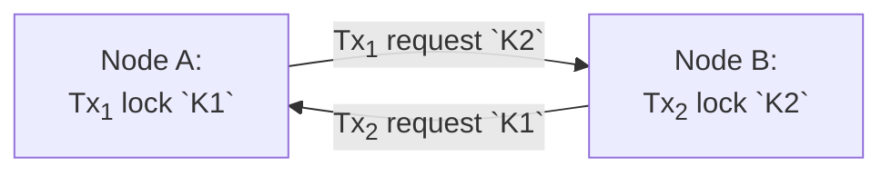
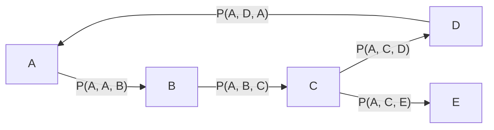

# Deadlock Detection and Resolution

Currently, Infinispan does not employ a mechanism for deadlock detection.
However, the code signals that a deadlock detection mechanism was previously in place for the `InfinispanLock` class.
This mechanism is necessary to rectify the cases where the concurrency mechanism can not provide transactions with the resources to proceed.
In such cases, the deadlock is a permanent state that does not change without external interference to the locking mechanism [1].
This document proposes an algorithm for deadlock detection and resolution to cover this gap.

This proposal does **not** aim to implement deadlock prevention.
This proposal does **not** aim to implement deadlock avoidance.
This proposal does **not** replace transaction/locking implementation.

In the next section, we detail the algorithm for deadlock detection.
Section 3 discusses how to implement the algorithm in Infinispan and how to perform the deadlock resolution.
Section 4 concludes with open questions for discussion.

## Algorithm

Utilizing a direct graph is a helpful way to analyze deadlock in transactions.
A cycle in this direct graph represents a deadlock in the system.
This cycle might originate when different transactions touch an overlapping set of resources.
When the locking mechanism executes, $Tx_1$​ becomes dependent on $Tx_2$​ to complete, and vice-versa.



The locking mechanism can not safely allow access to the resources for either $Tx_1$ or $Tx_2$.
The system will remain in this state until an external interference happens, e.g., a timeout in one of the nodes.
This kind of graph is *wait-for graph* (WFG) [1].

A deadlock detection algorithm usually analyzes the graph to detect cycles.
The resolution part of the algorithm involves selecting one of the transactions in the cycle (*victim*), and abort to break the cycle [1].

The algorithm proposed for deadlock detection is the Chandy-Misra-Haas algorithm [2], published in 1983.
The algorithm employs a single message: `Probe(i, j, k)`.
The basic idea is that node `j` in the system has a transaction waiting on node `k` to complete, so it forwards the message on behalf of the originator node `i`.

The system has a cycle when the originator node `i` receives a `Probe(i, j, i)` message from any node `j`.
The node can ignore the message if it does not have any external dependency.

### Chandy-Misra-Haas Algorithm

The initiator node `A` starts the algorithm.
Translating the pseudo-code [2], we have:

```python
dependents = dict()

def on_timeout(self): # Runs on the initiator.
    if self in dependents[self]: # If process is waiting itself.
        mark_deadlock()
    else:
        for process in system_process: # For every process in the system.
            if is_waiting(process)
                send(Probe(self, self, process))

def on_probe(self, i, j, k): # Runs upon receiving the probe message. self == k.
    if is_idle() and i not in dependents[k]:
        dependent[k].append(i) # Mark that we have already verified this process before.
        if i == k: # Cycle is closed, deadlock found.
            mark_deadlock()
        else:
            for process in system_process: # Continue disseminating the probes.
                if is_waiting(k, process):
                    send(Probe(i, self, process))
```

The algorithm begins proactively after an event.
Wait for a time $T$ for a resource to become available before starting the algorithm [2].
That is, executing the algorithm after a timeout is detected.
After a timeout, the local node sends a `Probe` command to every node holding a resource it is waiting for.

Upon receiving the `Probe` command, the process handles the message if it is waiting for resources to become available, and it (`self` or `k`) has not verified process `i` before, which helps the system quiescence.
The system has a deadlock if the initiator `i` is the current node `k`.
Otherwise, continue probing the processes the current node `k` is waiting for.

Below is an example of the algorithm executing.
The node `A` is the initiator process.



The algorithm works for deadlock detection, where the resolution part is not defined.

## Infinispan Implementation

We discuss how to implement the Chandy-Misra-Hass algorithm into Infinispan.
Following the suggestion to act after a timeout, we start the algorithm on the `TxDistributionInterceptor#visitLockControlCommand` upon receiving a `org.infinispan.commons.TimeoutException` while acquiring the locks remotely.
We start a new round of the algorithm, which resets the `dependentes` list.

The algorithm begins by identifying the transaction identifier in the current context.
This transaction identifier will point to where everything originated.
The initiator collects the information about the affected keys and identifies the primary owners to start probing.

For each primary involved in the transaction, the initiator sends a probe command:

```json
{
    "originator": "initiator-id",
    "tx": "initiator-tx-id",
    "keys": ["k1.0", "k2.0", "k3.0", ...]
}
```

The `keys` collection contains a subset of the transaction's affected keys owned by the specific node.

Upon receiving the probe command, each process traverses the complete list of keys and identifies the ones currently locked, utilizing the `LockManager`.
If no key is locked, the process can safely ignore the probe.
Otherwise, the process will acquire the `InfinispanLock` instance for each key.
For each lock, acquire the owner with `InfinispanLock#acquireOwner` to retrieve who's holding the key.
Only instances of `GlobalTransaction` objects are valid at this point.

At this stage, the process has transformed the initial `keys` into a collection of `GlobalTransaction` objects.
From the `GlobalTransaction`, the process needs to acquire information about the complete transaction.
That is, the node retrieves information about the affected keys to continue probing the processes it is currently depending on.

With the information on affected keys, the process can identify the primary owners of the transaction and relay the probe message.

```json
{
    "originator": "initiator-id",
    "tx": "initiator-tx-id",
    "keys": ["k1.1", "k2.1", "k3.1", ...]
}
```

This execution continues until there is a cycle or the initiator receives an empty response for all the initial probe commands.
In the latter case, the system is deadlock-free, and the timeout failed for another reason.
The probe does not happen on a snapshot.
The system might change while the probe mechanism runs.
But as long as the system is stuck, the deadlock is present.

In the former case, there is a deadlock in the system, and the process can act to solve it.
The easiest way to solve it is for the originator process to roll back the transaction associated with the transaction identifier relayed in all messages.
This way, the client can safely retry the transaction, and any other dependent transaction will be free to continue.

This approach of rolling back the transaction could lead to an undesired effect known as *over-killing*.
This effect could occur when different processes in the cycle start the algorithm simultaneously.
Multiple transactions could end up rolled back, whereas only one would be enough to break the chain.

## Conclusion

The instance of the deadlock algorithm belongs to a transaction context.
This approach would allow multiple instances to run in parallel cluster-wide.
The `dependents` mapping should help avoid duplicate invocations of the probe.

This implementation can live outside of the transaction/locking mechanism.
This approach facilitates testing, where we can test the algorithm directly and triggered by transaction/locking.
Additionally, it would allow us to make the behavior optional through a property.

### Open Questions

> How do we react when there is no deadlock in the system after probing?
> > Should the transaction automatically retry?

> Should we only consider a transaction if the locks are in the `WAITING` state?
> > If the transaction does not have locks in the `WAITING` state means the locks are successfully acquired and they are not waiting for some external resource.

> The `Probe` command should consider the topology ID. How do we handle topology changes?
> > Should cause a retry on the probe?

> Is there a difference between utilizing pessimistic/optimistic transactions in this regard?
> > Should the mechanism work only for pessimistic?

## References

[1] Özsu, T. M., & Valduriez, P. (2011). Principles of Distributed Database Systems.

[2] Chandy, K. M., Misra, J., & Haas, L. M. (1983). Distributed deadlock detection. ACM Transactions on Computer Systems (TOCS), 1(2), 144-156.