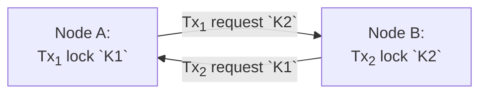
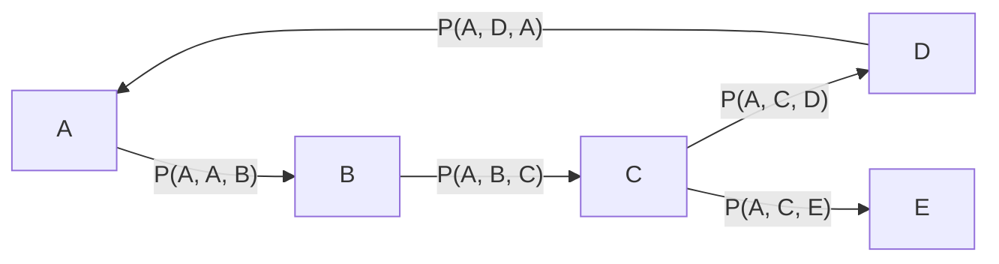

# Deadlock Detection and Resolution

Currently, Infinispan does not employ a mechanism for deadlock detection and resolution.
This mechanism is necessary to rectify the cases where the concurrency mechanism can not provide transactions with the resources to proceed.
In such cases, the deadlock is a permanent state that does not change without external interference to the locking mechanism [1].
This document proposes an algorithm for deadlock detection and resolution to cover this gap.

This proposal does **not** aim to implement deadlock prevention.
This proposal does **not** aim to implement deadlock avoidance.
This proposal does **not** replace transaction/locking implementation.

In the next section, we detail the algorithm for deadlock detection.
Section 3 discusses how to implement the algorithm in Infinispan and how to perform the deadlock resolution.
Section 4 concludes with open questions for discussion.

## Algorithm

Utilizing a direct graph is a helpful way to analyze deadlock in transactions.
A cycle in this direct graph represents a deadlock in the system.
This cycle might originate when different transactions touch an overlapping set of resources.
When the locking mechanism executes, $Tx_1$​ becomes dependent on $Tx_2$​ to complete, and vice-versa.



The locking mechanism can not safely allow access to the resources for either $Tx_1$ or $Tx_2$.
The system will remain in this state until an external interference happens, e.g., a timeout in one of the nodes.
This kind of graph is *wait-for graph* (WFG) [1].

A deadlock detection algorithm usually analyzes the graph to detect cycles.
The resolution part of the algorithm involves selecting one of the transactions in the cycle (*victim*), and abort to break the cycle [1].

The algorithm proposed for deadlock detection is the Chandy-Misra-Haas algorithm [2], published in 1983.
The algorithm employs a single message: `Probe(i, j, k)`.
The basic idea is that node `j` in the system has a transaction waiting on node `k` to complete, so it forwards the message on behalf of the originator node `i`.

The system has a cycle when the originator node `i` receives a `Probe(i, j, i)` message from any node `j`.
The node can ignore the message if it does not have any external dependency.

### Chandy-Misra-Haas Algorithm

The algorithm begins after an external event.
Wait for a time $T$ for a resource to become available before starting the algorithm [2].
That is, executing the algorithm after a timeout is detected.
After a timeout, the local node sends a `Probe` command to every node holding a resource it is waiting for.

Upon receiving the `Probe` command, the process handles the message if it is waiting for resources to become available, and it (`self` or `k`) has not verified process `i` before, which helps the system quiescence.
The system has a deadlock if the initiator `i` is the current node `k`.
Otherwise, continue probing the processes the current node `k` is waiting for.

The algorithm can identify cycles by "creating" the WFG on demand.
To be precise, the algorithm is an edge-chasing algorithm for the AND resource model.
Edge-chasing algorithms utilize probe messages to traverse the edges instead of keeping a global view of the WFG.
The AND resource model means any process can request one or more resources simultaneously and is only satisfied if all resources are available.

Below is an example of the algorithm executing.
The node `A` is the initiator process.
Consider the cycle defined as $`\mathcal{C}=\{A, B, C, D\}`$.



In the above example, if all the processes in $\mathcal{C}$ start the algorithm concurrently, it might lead to aborting multiple transactions to deal with deadlocks or even report phantom deadlocks.
Additionally, nodes in $\mathcal{C}$ exchange numerous redundant messages, where only a single process breaking the deadlock would be enough to resume a stable state.

In a later work [3], the authors require the transactions to have a uniquely sortable identifier, and nodes only accept probes from initiators with a transaction with a higher identifier.
This technique reduces the number of messages in the system and guarantees only a single process breaks the deadlock cycle.
In this work, the authors have more assumptions in the environment (related to message ordering) and focus on a single resource model.
However, we can employ a similar technique for our implementation.

## Infinispan Implementation

We discuss how to implement the Chandy-Misra-Hass algorithm into Infinispan.
We'll split it into multiple sections to address the steps individually.
We discuss how to trigger the algorithm, how it works, and an example execution.

### Algorithm

This section describes how the algorithm works in the context of Infinispan.
First, we define how we trigger the deadlock detection.
Following, we explain how the algorithm works, which components are necessary to work, and how nodes interact.
This explanation is tightly coupled to Infinispan to avoid being abstract in terminology or data structures.
Finally, we simulate runs of the algorithm.

#### Triggering

Since the algorithm involves sending more messages (concurrent) during the transaction execution, we make it disabled by default.
Users should set a property in the `<transaction` element to enable deadlock detection.
If the algorithm is enabled (`<transaction deadlock-detection="true" />`), we run the algorithm while locking the keys for a transaction.

A system will remain in a deadlock state until an external interference happens.
This behavior means Infinispan will hang until the configured lock acquisition timeout elapses.
Therefore, with the algorithm concurrently executing while acquiring keys, we can detect a deadlock earlier than the timeout.
If a deadlock never happens, the transaction completes without interference from the deadlock detection algorithm.

We do not need to trigger the algorithm always a transaction locks keys.
After locking a key (or a collection) on the `DefaultLockManager` class, we verify if the acquisition is completed (`LockPromise#isAvailable`).
We don't need to execute the algorithm when the lock is available.
Otherwise, when a lock is not readily available, we trigger the deadlock detection algorithm.

In what follows, we describe how the algorithm works in Infinispan.

#### Implementation

We assume the cache is allowed to run the deadlock algorithm (`<transaction deadlock-detection="true" />`).
We perform the initial check while acquiring the locks for a transaction on the `DefaultLockManager` using the `lock` and `lockAll` methods.
We verify if the lock is available after acquiring the promise from the `LockContainer`.
If the lock is available, we can continue without starting the algorithm.
Otherwise, we utilize an instance of the `DistributedDeadlockDetection` to start the algorithm before returning the lock promise to the caller.

The `DistributedDeadlockDetection` is a new class that implements the Chandy-Misra-Hass algorithm for Infinispan.
The entry point to trigger the algorithm receives the lock's current (`holder`) and the pending owner (`initiator`).
From the lock's point of view, the owner is just an arbitrary `Object` to acquire the lock.
However, the owner must be a `GlobalTransaction` object for deadlock detection.

With the `GlobalTransaction` instance, we can identify which node the transaction belongs to.
We instantiate a `Probe(initiator, holder)` command to send to the remote node.
We attach the initiator to track where the command originates and the holder to identify the transaction on the remote node.
We execute the `Probe` command on a transactional context at the remote node.
Additionally, the command should be affected by topology changes and be local to a cache.

Upon receiving the `Probe` command, the remote node invokes the `DistributedDeadlockDetection` instance to verify cycles and redirect additional probes.
We need to verify all keys in the transactional context of the holder.
We submit an additional `Probe` command to the node holding the key's lock.

The WFG has a cycle if the `initiator` and `holder` objects are equal.
The cycle means the `Probe` command has traversed from multiple nodes until depending on itself.
The algorithm can complete the local deadlock check and mark the locks with the `DEADLOCK` state.
Finally, we roll back the transaction with a `DeadlockDetectedException` error.

The last step is crucial to guarantee liveness.
During the rollback, we send the `RollbackCommand` command remotely and execute it locally, which causes the locks to be released.
By design, a transaction acquires first the remote locks and then locally.
Failing by deadlock on the remote means the lock is not acquired locally.
However, to guarantee liveness and to eventually identify all cycles in the WFG, every time a key tries to release a lock, existent or not, we trigger the probe mechanism again for the affected keys.

#### Scenarios

The above algorithm should identify deadlock involving multiple nodes in the system.
However, it would still suffer from many transactions aborting when multiple nodes start the algorithm concurrently.
We apply the technique from [3] to abort a single transaction per cycle.
More concretely, we need a way to order the transactions deterministically and only allow probes from an initiator higher than the holder.

We update the `GlobalTransaction` to extend `Comparable<GlobalTransaction>` for ordering.
The class already has a long scalar identifier and the node's address.
We use the node's address for ordering and the scalar to break ties.
We utilize the ordering on the `DistributedDeadlockDetection` implementation and only proceed with execution if the initiator is higher than the current lock's holder.

The decision to continue when the initiator is higher than the holder is arbitrary.
This approach allows "older" transactions to proceed while aborting more recent ones.
We could invert the check to abort older transactions and prioritize more recent ones.

Below, we have a pseudo-code overly simplifying the algorithm:


```code
procedure lock(keys, initiator):
    let locks = DefaultLockManager#lockAll(keys)
    for lock ∈ locks do
        if !available(lock) then
            inspect_transaction(owner(lock), initiator)


procedure inspect_transaction(holder, initiator):
    if initiator > holder then
        send(Probe(initiator, holder))

when receive(Probe(initiator, holder)):
    if initiator = holder then
        rollback(holder)
        return

    let locked = {lock_owner(k): k ∈ keys(holder)} \ {holder}
    for h ∈ locked do
        inspect_transaction(h, initiator)

when rollback(rolling_back):
    for k ∈ keys(rolling_back) do
        let owner = LockContainer#getLock(k)
        let locks = LockContainer#pendingLocks(k)
        for lock ∈ locks do
            inspect_transaction(owner, lock)
```

The figure below shows a scenario where multiple transactions lock the same set of keys.
In this example, $`Tx_1=Tx_2=Tx_3=\{K1, K2, K3\}`$ and $`Tx_1 < Tx_2 < Tx_3`$.
Since none of the nodes acquire the remote locks, they enter into a deadlock state.
From each node's perspective, there are two cycles, for example, $`Tx_1\rightarrow Tx_2 \rightarrow Tx_1`$ and $`Tx_1 \rightarrow Tx_3 \rightarrow Tx_1`$.
Therefore, to commit a transaction, the algorithm must abort two transactions.
The `L` is an `LockControlCommand`, `P` is the `Probe`, and `LR` is the `RollbackCommand`.


## Conclusion

The algorithm should execute concurrently alongside the usual mechanism of transactions.
Ideally, if enabled, the overhead on running transactions should be minimal.
The transactions do not depend on the algorithm's information to complete.
The overhead happens because of the additional messages exchanged.

If a transaction deadlocks, the algorithm should identify the cycle sooner than waiting for timeouts, and it should limit the impact by only rolling back as few transactions as needed to proceed.
Otherwise, without the algorithm running, all the transactions in the cycle would hang until the timeout elapses.

### Open Questions 

The `Probe` command should consider the topology ID. Do we retry due to topology changes? What happens to the locks during the topology changes? Depending on how they behave, the algorithm would restart by design. 

## References

[1] Özsu, T. M., & Valduriez, P. (2011). Principles of Distributed Database Systems.

[2] Chandy, K. M., Misra, J., & Haas, L. M. (1983). Distributed deadlock detection. ACM Transactions on Computer Systems (TOCS), 1(2), 144-156.

[3] Roesler, Marina, and Walter A. Burkhard. "Resolution of deadlocks in object-oriented distributed systems." IEEE Transactions on Computers 38.8 (1989): 1212-1224.